# 👨🏾‍💻 Section 03: First Step in NestJS

<p align="center">
  <a href="http://nestjs.com/" target="blank"></a>
</p>

[circleci-image]: https://img.shields.io/circleci/build/github/nestjs/nest/master?token=abc123def456
[circleci-url]: https://circleci.com/gh/nestjs/nest

  <p align="center">A progressive <a href="http://nodejs.org" target="_blank">Node.js</a> framework for building efficient and scalable server-side applications.</p>
    <p align="center">
<a href="https://www.npmjs.com/~nestjscore" target="_blank"></a>
<a href="https://www.npmjs.com/~nestjscore" target="_blank"></a>
<a href="https://www.npmjs.com/~nestjscore" target="_blank"></a>
<a href="https://circleci.com/gh/nestjs/nest" target="_blank"></a>
<a href="https://discord.gg/G7Qnnhy" target="_blank"></a>
<a href="https://opencollective.com/nest#backer" target="_blank"></a>
<a href="https://opencollective.com/nest#sponsor" target="_blank"></a>
  <a href="https://paypal.me/kamilmysliwiec" target="_blank"></a>
    <a href="https://opencollective.com/nest#sponsor"  target="_blank"></a>
  <a href="https://twitter.com/nestframework" target="_blank"></a>
</p>
  <!--[](https://opencollective.com/nest#backer)
  [](https://opencollective.com/nest#sponsor)-->

---
## 📚 Lecture 029: Instalar Nest CLI - Command Line Interface

### 1. Install Nest globally:
In Windows:
```bash
npm i -g @nestjs/cli
```

In Mac:
```bash
sudo npm i -g @nestjs/cli
```

### 2. Verif nestjs version:
```bash
nest -v
```

## 📚 Lecture 030: Generate first project - CarDealership

### 1. Execute from terminal:
```bash
nest new car-dealership
npm
```
then:
```bash
？Which package manager would you ❤️ to use?
> npm
```

Expected prompt:
```bash
cd car-dealership
npm run start:dev
```


## 📚 Lecture 031: Explanation of each file and directory

### 1. Visual Project Structure:
```
02-car-dealership/
├── node_modules/                 # Project dependencies
├── src/                          # Main source code
│   ├── app.controller.ts         # Main controller (handles incoming requests and routes)
│   ├── app.controller.spec.ts    # Unit tests for the main controller
│   ├── app.service.ts            # Main service (contains business logic)
│   ├── app.module.ts             # Root application module
│   └── main.ts                   # Application entry point
│
├── test/                         # End-to-end (e2e) tests
│   ├── app.e2e-spec.ts           # Example e2e test file
│   └── jest-e2e.json             # Jest configuration for e2e tests
│
├── .eslintrc.js                  # ESLint configuration (code linting rules)
├── .prettierrc                   # Prettier configuration (code formatting)
├── nest-cli.json                 # Nest CLI configuration file
├── package.json                  # Project metadata, dependencies, and scripts
├── tsconfig.build.json           # TypeScript config for building the project
├── tsconfig.json                 # General TypeScript configuration
└── README.md                     # Project documentation
```


## 📚 Lecture 032: Modules

### 1. Keep this project as simple for first step:
```
02-car-dealership/
├── node_modules/                 # Project dependencies
├── src/                          # Main source code
│   ├── app.module.ts             # Root application module ✅
│   └── main.ts                   # Application entry point
│
├── test/                         # End-to-end (e2e) tests
│   ├── app.e2e-spec.ts           # Example e2e test file
│   └── jest-e2e.json             # Jest configuration for e2e tests
│
├── .eslintrc.js                  # ESLint configuration (code linting rules)
├── .prettierrc                   # Prettier configuration (code formatting)
├── nest-cli.json                 # Nest CLI configuration file
├── package.json                  # Project metadata, dependencies, and scripts
├── tsconfig.build.json           # TypeScript config for building the project
├── tsconfig.json                 # General TypeScript configuration
└── README.md                     # Project documentation
```

### 2. Open **`app.module.ts`** file and update it as follows:
```ts
import { Module } from '@nestjs/common';
@Module({
  imports: [],
  controllers: [],
  providers: [],
  exports: [],
})
export class AppModule {
  //...AppModule is a simple class with a decorator.
}
```

### 3. From Postman
1. Method: **GET**
2. URL: **http://localhost:3000**
3. Response:
    ```json
    {
      "message": "Cannot GET /",
      "error": "Not Found",
      "statusCode": 404
    }
    ```
4. Status: **404**    

    

### 4. From **`http://localhost:3000`**:
  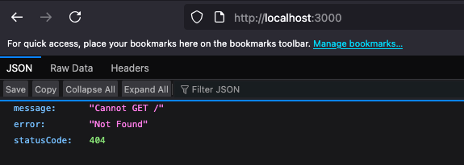


## 📚 Lecture 033: Controllers


### Execute:

#### 1. In order to see command help:
```bash
nes -h
```

#### 2. In. order to generate **`cars.module.ts`** file:

```bash
nest g mo cars
```

> 2.1 Visual Project Structure:
```
02-car-dealership/
├── node_modules/                 # Project dependencies (automatically installed via npm)
├── src/                          # Main source code
│   ├── cars/                     # Cars module (feature module) ✅
│   │   └── cars.module.ts        # Module definition for cars ✅
│   ├── app.module.ts             # Root application module
│   └── main.ts                   # Application entry point (creates and boots the NestJS app)
│
├── test/                         # End-to-end (e2e) tests
│   ├── app.e2e-spec.ts           # Example e2e test file
│   └── jest-e2e.json             # Jest configuration for e2e tests
│
├── .eslintrc.js                  # ESLint configuration (code linting rules)
├── .prettierrc                   # Prettier configuration (code formatting)
├── nest-cli.json                 # Nest CLI configuration file
├── package.json                  # Project metadata, dependencies, and scripts
├── package-lock.json             # Exact dependency tree (if using npm)
├── tsconfig.build.json           # TypeScript config for building the project
├── tsconfig.json                 # General TypeScript configuration
├── .env.example                  # Example environment variables file
├── .gitignore                    # Git ignore file
└── README.md                     # Project documentation
```

> 2.2 Verify updates in **`app.module.ts`** file:
```ts
import { Module } from '@nestjs/common';
import { CarsModule } from './cars/cars.module';  // 👈🏽 ✅

@Module({
  imports: [CarsModule],  // 👈🏽 ✅
  controllers: [],
  providers: [],
  exports: [],
})
export class AppModule {
  //...
}
```

#### 3. In order to **`cars.controller.ts`** file:

```bash
nest g co cars
```

> 3.1 outcome:
```bash
CREATE src/cars/cars.controller.spec.ts (478 bytes)
CREATE src/cars/cars.controller.ts (97 bytes)
UPDATE src/cars/cars.module.ts (166 bytes)
```

> 3.2 Visual Project structure:
```
02-car-dealership/
│── node_modules/                      # 📦 Project dependencies
├── src/
│   ├── cars/                          # 🚗 Feature module - Car management
│   │   │── cars.controller.ts         # Car CRUD operations
│   │   │── cars.controller.spec.ts
│   │   └── cars.module.ts             # 🧩 Car feature module
│   ├── app.module.ts                  # 🌐 Root application module
│   └── main.ts                        # 🚀 Application entry point
├── test/                              # 🧪 End-to-end (e2e) tests
│   ├── app.e2e-spec.ts                # Example e2e test file
│   └── jest-e2e.json                  # Jest configuration for e2e tests
│── package.json                       # 📋 Project metadata, dependencies, and scripts
│── package-lock.json                  # 🔒 Locked dependency versions
│── nest-cli.json                      # 🪄 Nest CLI configuration
│── tsconfig.json                      # 📘 General TypeScript configuration
│── tsconfig.build.json                # 🏗️ TypeScript config for building
│── .eslintrc.js                       # ✨ ESLint configuration
│── .prettierrc                        # 🎨 Prettier code formatting
│── .env.example                       # 🔐 Environment variables template
├── README.md                          # 📖 Project documentation
└── .gitignore                         # 🙈 Git ignore rules
```

> 3.3 In **`cars.module.ts`** file:
```ts
import { Module } from '@nestjs/common';
import { CarsController } from './cars.controller';  // 👈🏽 ✅
@Module({
  controllers: [CarsController],  // 👈🏽 ✅
})
export class CarsModule {}
```

> 3.4 In **`cars.controller.ts`** file:
```ts
import { Controller } from '@nestjs/common';
@Controller('cars')
export class CarsController {
  //... nothing => 404 Not found!
}
```

> 3.5 In Postman:

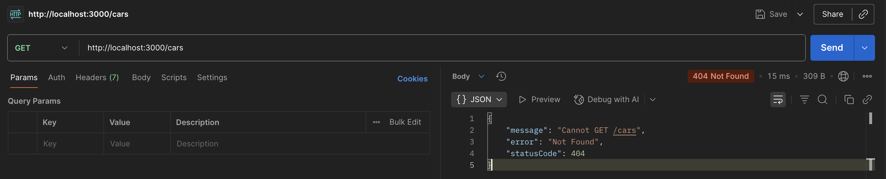


#### 4. Add a private cars array :
```ts
import { Controller, Get } from '@nestjs/common';

@Controller('cars')
export class CarsController {
  private cars = ['Toyota', 'Ford', 'Chevrolet', 'BMW', 'Mercedes', 'Audi'];
  @Get()
  getAllCars() {
    return this.cars;
  }
}
```


## 📚 Lecture 035: Getting a car by its ID

### 1. Add a new method in cars.controller:
```ts
import { Controller, Get, Param } from '@nestjs/common';
@Controller('cars')
export class CarsController {
  private cars = ['Toyota', 'Ford', 'Chevrolet', 'BMW', 'Mercedes', 'Audi'];
  @Get()
  getAllCars() {
    return this.cars;
  }

  // get car by ID:
  @Get(':id')
  getCarById(@Param('id') id: number) {
    console.log({ id });
    return {
      message: 'success',
      id: id,
      car: this.cars[+id],
    };
  }
}
```

> Outcome from Postmand and Server(terminal)
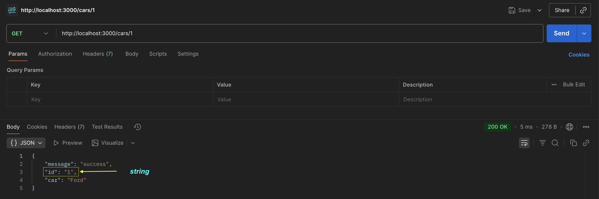
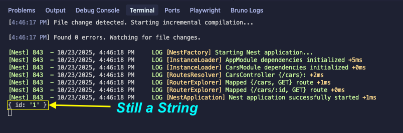

### 2. Transform the **`id`** to number:
```ts
import { Controller, Get, Param } from '@nestjs/common';
@Controller('cars')
export class CarsController {
  private cars = ['Toyota', 'Ford', 'Chevrolet', 'BMW', 'Mercedes', 'Audi'];
  @Get()
  getAllCars() {
    return this.cars;
  }
  // get car by ID:
  @Get(':id')
  getCarById(@Param('id') id: number) {
    console.log({ id: +id });
    return {
      message: 'success',
      id: +id,
      car: this.cars[+id],
    };
  }
}
```

> Outcome from Postmand and Server(terminal)

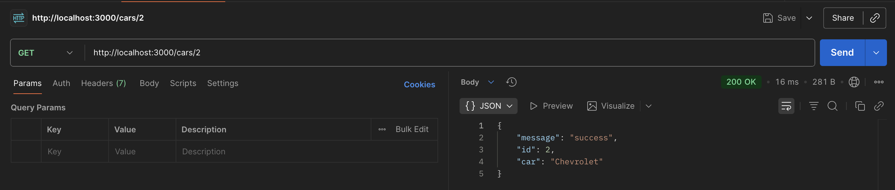
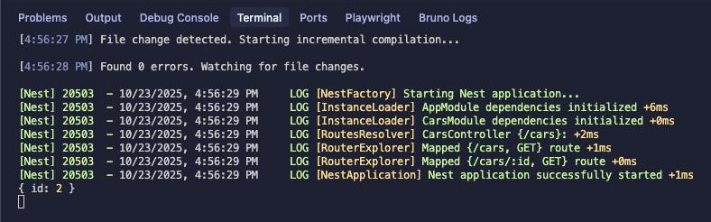


### 3. Search for an ID out of array length:
```ts
private cars = ['Toyota', 'Ford', 'Chevrolet', 'BMW', 'Mercedes', 'Audi'];

console.log(cars.length) // 6
```

#### Search for **`ID = 6`**
1. Method: GET
2. URL: **`http://localhost:3000/cars/6`**
3. Status Code: **`200 OK`** ❌
4. Response: ❌
    ```json
    {
        "message": "success",
        "id": 6
    }
    ```

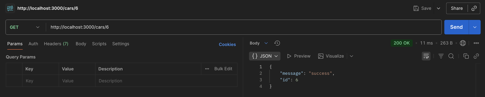


## 📚 Lecture 036: Services

### 1. Create **`ccars.service`** file from terminal:
```bash
nest g s cars --no-spec
```

> Outcome:
```
CREATE src/cars/cars.service.ts
UPDATE src/cars/cars.module.ts
```

> besides:
```ts
// ./src/cars/cars.service.ts
import { Injectable } from '@nestjs/common';
@Injectable()
export class CarsService {}
```
> and
```ts
// ./src/cars/cars.module.ts
import { Module } from '@nestjs/common';
import { CarsController } from './cars.controller';
import { CarsService } from './cars.service';  // 👈🏽 ✅
@Module({
  controllers: [CarsController],
  providers: [CarsService],  // 👈🏽 ✅
})
export class CarsModule {}
```

### 2. Move cars array from **`cars.cntroller.ts`** to **`cars.service.ts`** file:
```ts
// ./src/cars/cars.service.ts
import { Injectable } from '@nestjs/common';
@Injectable()
export class CarsService {
  private cars = [
    {
      id: 1,
      brand: 'Toyota',
      model: 'Corolla',
    },
    {
      id: 2,
      brand: 'Ford',
      model: 'Mustang',
    },
    {
      id: 3,
      brand: 'Chevrolet',
      model: 'Camaro',
    },
    {
      id: 4,
      brand: 'BMW',
      model: 'X5',
    },
    {
      id: 5,
      brand: 'Mercedes',
      model: 'C63',
    },
    {
      id: 6,
      brand: 'Audi',
      model: 'A4',
    },
  ];
}

```

> There must be some errors due to missing cars array in cars.controller.ts file.

## 📚 Lecture 037: Dependency Injection

### 1. create **`finAll`** method in **`cars.service.ts`**:
```ts
import { Injectable } from '@nestjs/common';

@Injectable()
export class CarsService {
  private cars = [
    {
      id: 1,
      brand: 'Toyota',
      model: 'Corolla',
    },
    {
      id: 2,
      brand: 'Ford',
      model: 'Mustang',
    },
    {
      id: 3,
      brand: 'Chevrolet',
      model: 'Camaro',
    },
    {
      id: 4,
      brand: 'BMW',
      model: 'X5',
    },
    {
      id: 5,
      brand: 'Mercedes',
      model: 'C63',
    },
    {
      id: 6,
      brand: 'Audi',
      model: 'A4',
    },
  ];

  findAll() {  // 👈🏽 ✅
    return this.cars;
  }
}
```

### 2. Create an instance of **`cars.service`** inside **`cars.controller`** constructor.
```ts
import { Controller, Get } from '@nestjs/common';
import { CarsService } from './cars.service';

@Controller('cars')
export class CarsController {
  constructor(private readonly carsService: CarsService) {}
  @Get()
  getAllCars() {
    return this.carsService.findAll();
  }
}
``` 

> Outcome:

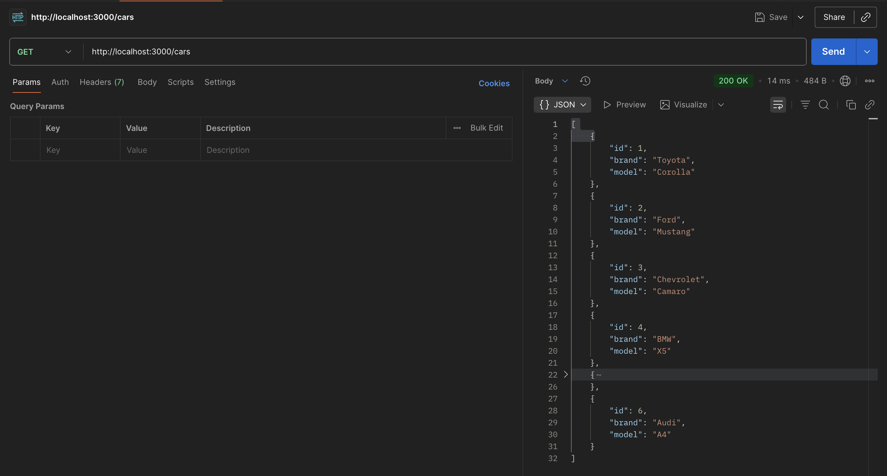


### 3. create the **`findOneById()`** method:
```ts
// ./src/cars/cars.service.ts
import { Injectable } from '@nestjs/common';
@Injectable()
export class CarsService {
  private cars = [
    {
      id: 1,
      brand: 'Toyota',
      model: 'Corolla',
    },
    {
      id: 2,
      brand: 'Ford', //
      model: 'Mustang',
    },
    {
      id: 3,
      brand: 'Chevrolet',
      model: 'Camaro',
    },
    {
      id: 4,
      brand: 'BMW',
      model: 'X5',
    },
    {
      id: 5,
      brand: 'Mercedes',
      model: 'C63',
    },
    {
      id: 6,
      brand: 'Audi',
      model: 'A4',
    },
  ];

  findAll() {
    return this.cars;
  }
  findOneById(id: number) {  // 👈🏽 ✅
    return this.cars.filter((car) => car.id === id);
  }
}
```

```ts
// ./src/cars/cars.controller.ts
import { Controller, Get, Param } from '@nestjs/common';
import { CarsService } from './cars.service';
@Controller('cars')
export class CarsController {
  constructor(private readonly carsService: CarsService) {}
  @Get()
  getAllCars() {
    return this.carsService.findAll();
  }
  @Get(':id')
  getCarById(@Param('id') id: number) {  // 👈🏽 ✅
    return this.carsService.findOneById(+id);
  }
}
```
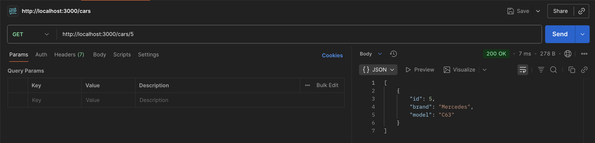
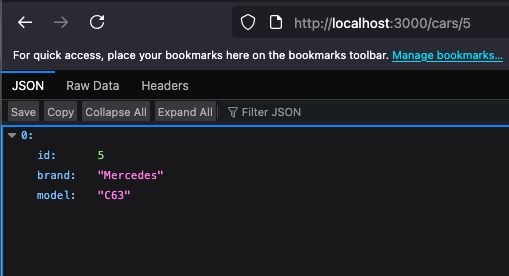

First try with :
```ts
  @Get(':id')
  getCarById(@Param('id') id: number) {  // 👈🏽 ✅
    console.log({ id: +id});
    return this.carsService.findOneById(id); // "id" is not a number
  }
```

### 4. Tech Debt: Need validation!
1. Enter any ID out of array range as 8
2. Enter any value as ID (i.e. "house")

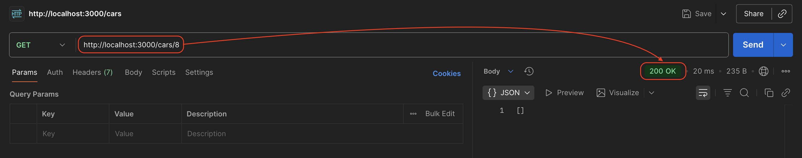
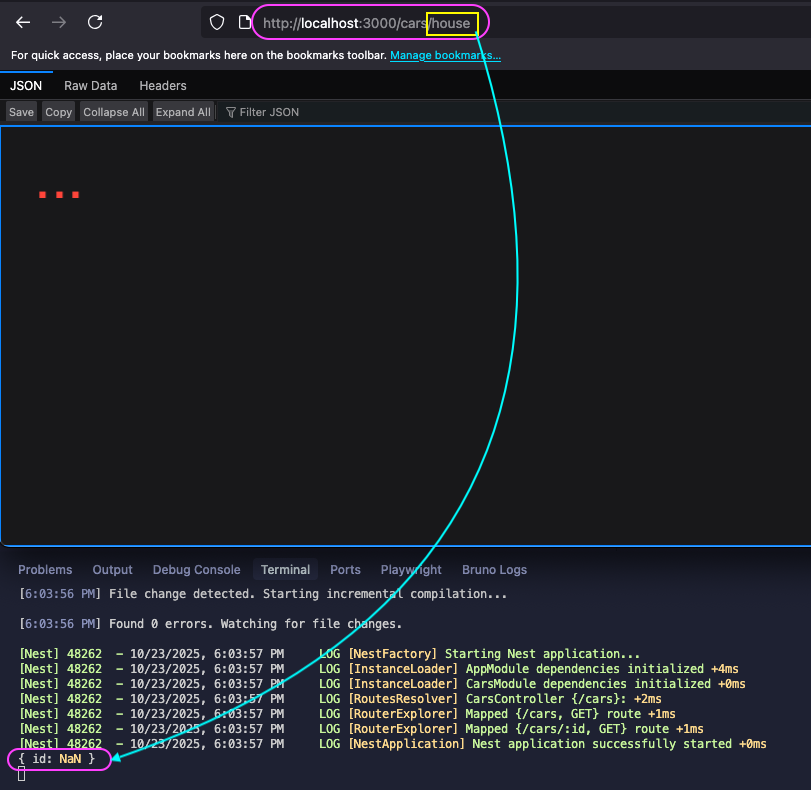

## 📚 Lecture 038: Pipes

### 1. Using **`ParseIntPipe`** for validation:
```ts
// ./src/cars/cars.controller.ts
import { Controller, Get, Param, ParseIntPipe } from '@nestjs/common';  // 👈🏽 ✅
import { CarsService } from './cars.service';

@Controller('cars')
export class CarsController {
  //private cars = ['Toyota', 'Ford', 'Chevrolet', 'BMW', 'Mercedes', 'Audi'];
  constructor(private readonly carsService: CarsService) {}
  @Get()
  getAllCars() {
    return this.carsService.findAll();
  }

  @Get(':id')
  getCarById(@Param('id', ParseIntPipe) id: number) {  // 👈🏽 ✅
    console.log({ id: id });
    return this.carsService.findOneById(id);
  }
}
```

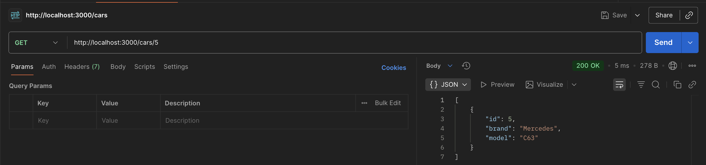
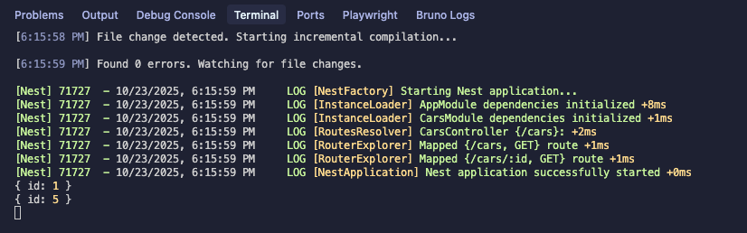

### 2. Validation Type:
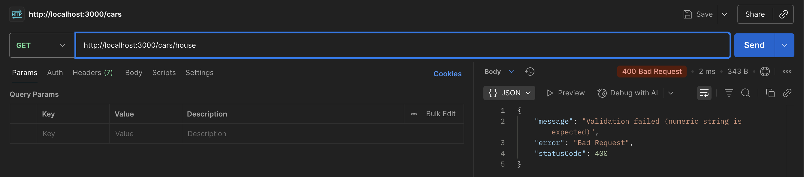

### 3. Error 500:

Adding **`throw new Error('S.O.S');`**
```ts
  @Get(':id')
  getCarById(@Param('id', ParseIntPipe) id: number) {
    console.log({ id: id });
    throw new Error('S.O.S');  // 👈🏽 ✅
    return this.carsService.findOneById(id);
  }
```
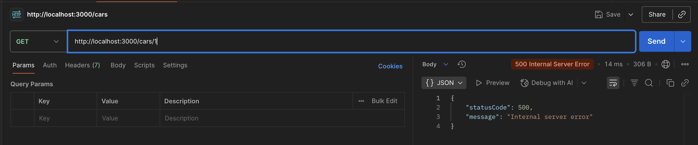

## 📚 Lecture 039: Exception Filters

### 1. visit [Exception filters in NestJS](https://docs.nestjs.com/exception-filters)


### 2. Add **`NotFoundException()`** in **`cars.service.ts`**file:
> In order to make an assessment regarding the out of araange.

```ts
import { Injectable, NotFoundException } from '@nestjs/common';  // 👈🏽 ✅
@Injectable()
export class CarsService {
  private cars = [
    {
      id: 1,
      brand: 'Toyota',
      model: 'Corolla',
    },
    //...
    {
      id: 6,
      brand: 'Audi',
      model: 'A4',
    },
  ];
  findAll() {
    return this.cars;
  }
  findOneById(id: number) {
    const car = this.cars.find((car) => car.id === id);
    if (!car) throw new NotFoundException();  // 👈🏽 ✅
    return car;
  }
}
```

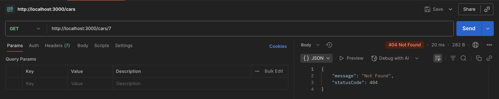

### 3. Customize response message:
```ts
//...
  findOneById(id: number) {
    const car = this.cars.find((car) => car.id === id);
    if (!car) throw new NotFoundException(`Car with id '${ id }' was not found!`);  // 👈🏽 ✅
    return car;
  }
```
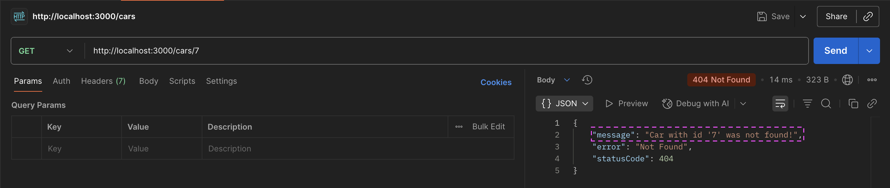

## 📚 Lecture 040: Post, Patch y Delete

### 1. Create first **`POST`** in **`cars.controller.ts`** file:
```ts
import { Controller, Get, Param, ParseIntPipe, Post } from '@nestjs/common';  // 👈🏽 ✅
import { CarsService } from './cars.service';
@Controller('cars')
export class CarsController {
  constructor(private readonly carsService: CarsService) {}
  @Get()
  getAllCars() {
    return this.carsService.findAll();
  }
  @Get(':id')
  getCarById(@Param('id', ParseIntPipe) id: number) {
    console.log({ id: id });
    return this.carsService.findOneById(id);
  }
  @Post()  // 👈🏽 ✅
  createCar() {
    return {
      ok: true,
      method: 'POST',
    };
  }
}
```

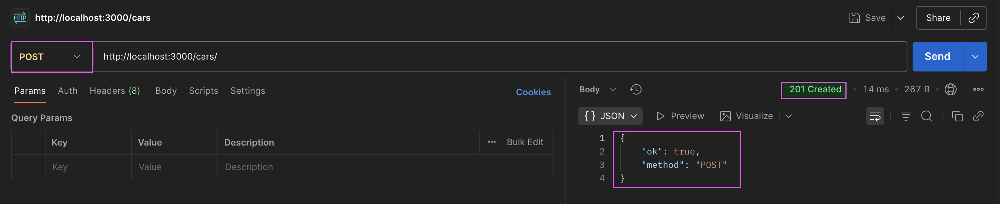


#### With Payoad:
```ts
  //...
  @Post()  // 👈🏽 ✅
  createCar(@Body() payload: any) {
    return payload;
  }
```
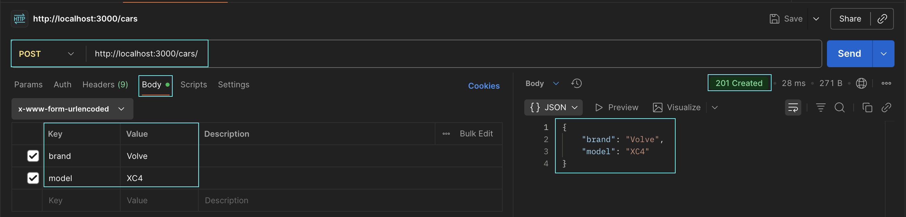

#### 🚧 Validation requirements:
- Key validation names and format.
- Key name values validation

### 2. Create first **`PATCH`** in **`cars.controller.ts`** file:

```ts
import {
  Controller,
  Get,
  Param,
  ParseIntPipe,
  Post,
  Body,
  Patch,  // 👈🏽 ✅
} from '@nestjs/common';
import { CarsService } from './cars.service';

@Controller('cars')
export class CarsController {
  //private cars = ['Toyota', 'Ford', 'Chevrolet', 'BMW', 'Mercedes', 'Audi'];
  constructor(private readonly carsService: CarsService) {}
  @Get()
  getAllCars() {
    return this.carsService.findAll();
  }

  @Get(':id')
  getCarById(@Param('id', ParseIntPipe) id: number) {
    console.log({ id: id });
    return this.carsService.findOneById(id);
  }

  @Post()
  createCar(@Body() payload: any) {
    return payload;
  }

  @Patch(':id')  // 👈🏽 ✅
  updateCar(@Param('id', ParseIntPipe) id: number, @Body() payload: any) {
    return payload;
  }
}
```

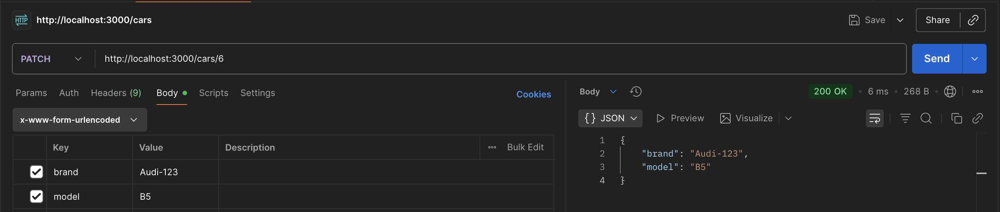

#### Misssing validations:

### 3. First **`DELETE`** in **`cars.controller.ts`** file:

```ts
import {
  Controller,
  Get,
  Param,
  ParseIntPipe,
  Post,
  Body,
  Patch,
  Delete,  // 👈🏽 ✅
} from '@nestjs/common';
import { CarsService } from './cars.service';
@Controller('cars')
export class CarsController {
  constructor(private readonly carsService: CarsService) {}
  @Get()
  getAllCars() {
    return this.carsService.findAll();
  }
  @Get(':id')
  getCarById(@Param('id', ParseIntPipe) id: number) {
    console.log({ id: id });
    return this.carsService.findOneById(id);
  }
  @Post()
  createCar(@Body() payload: any) {
    return payload;
  }
  @Patch(':id')
  updateCar(@Param('id', ParseIntPipe) id: number, @Body() payload: any) {
    return payload;
  }
  @Delete(':id')  // 👈🏽 ✅
  deleteCar(@Param('id', ParseIntPipe) id: number) {
    return {
      method: 'delete',
      id,
    };
  }
}
```
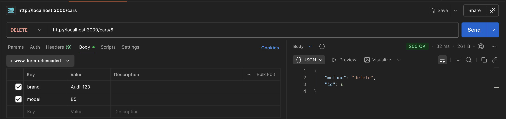

--- 
# 👨🏾‍💻 Section 04: DTOs and validation of information


## 📚 Lecture 043: Section topics

```
DTO (Data Transfer Object)
- Patch, Post, Delete
- Automatic validations
- Class Validator
- Class Transformer
- Follow the DRY principle (Don’t Repeat Yourself)
- Some useful decorators from Class Validator
```

