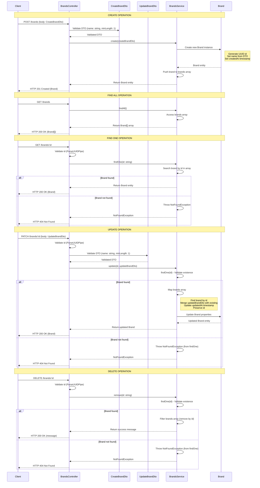
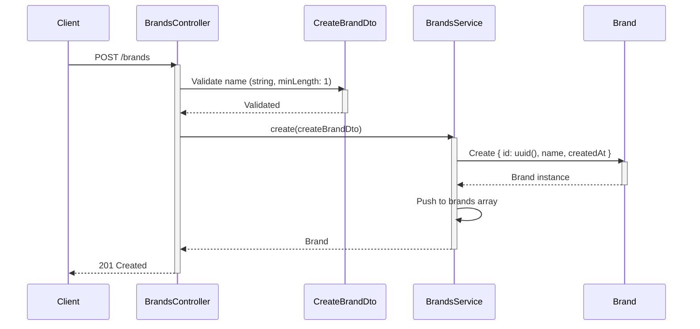
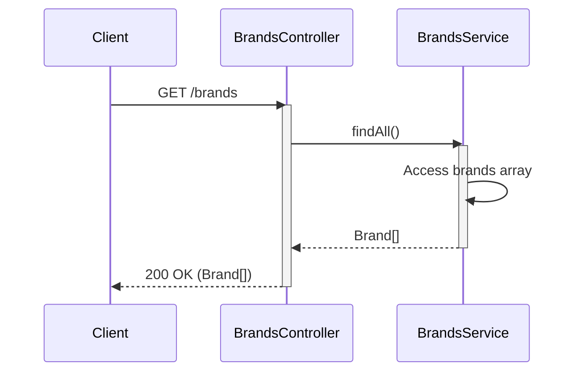
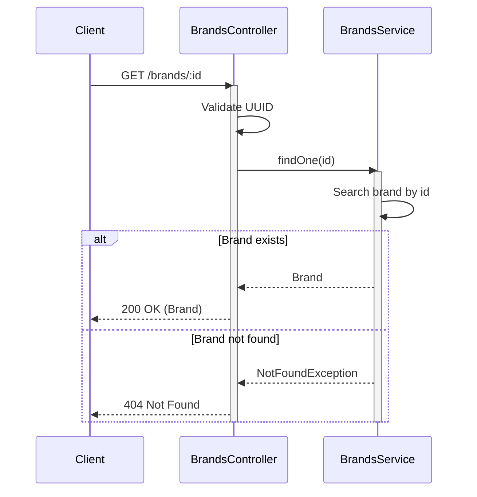
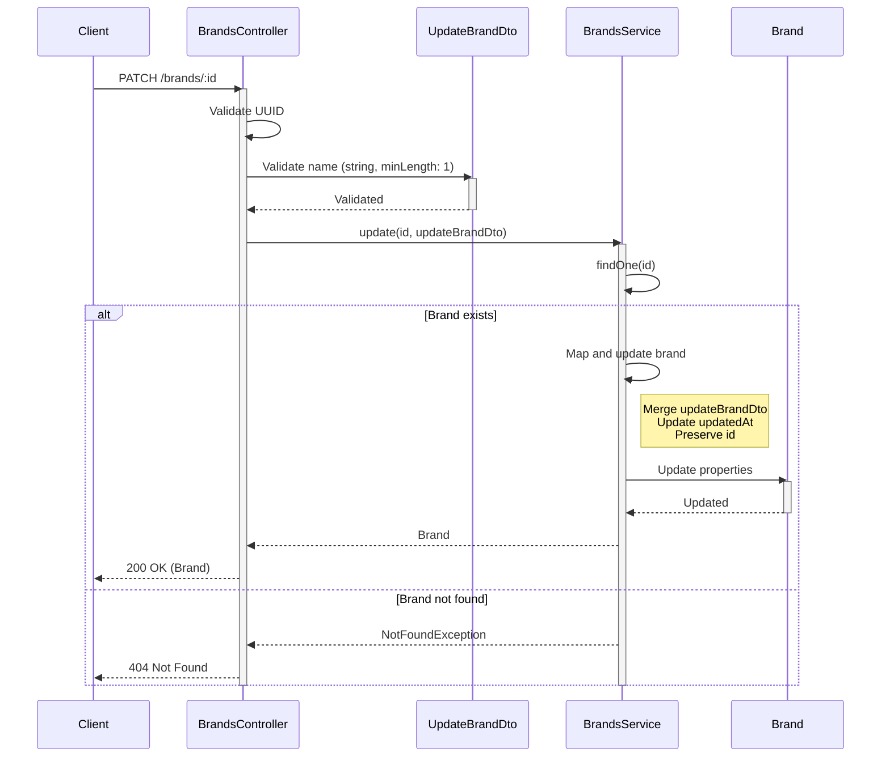
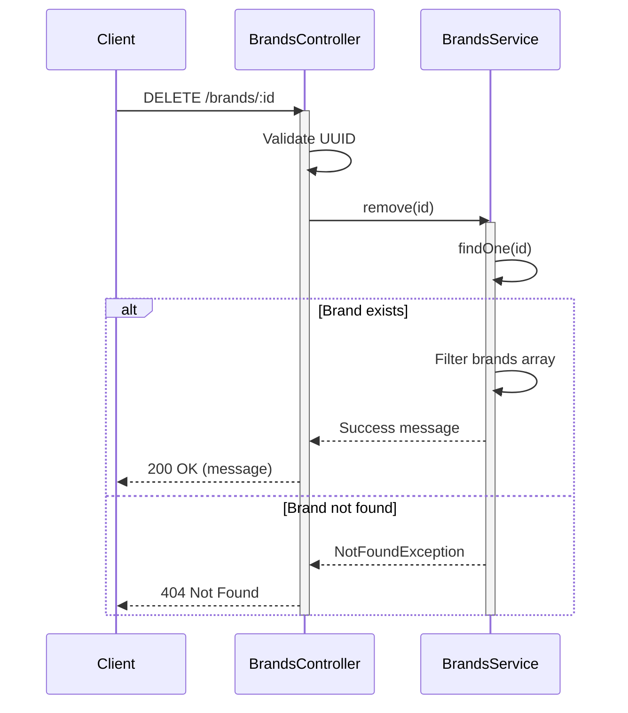

# Brand Module Sequence Diagram

This document contains sequence diagrams for all operations in the Brand module, showing the interaction between the Controller, Service, DTOs, and Entity.

## Module Structure

The Brand module consists of:
- **BrandsModule**: Module that configures the Controller and Service
- **BrandsController**: Handles HTTP requests
- **BrandsService**: Contains business logic
- **CreateBrandDto**: DTO for creating brands
- **UpdateBrandDto**: DTO for updating brands
- **Brand Entity**: Entity representing a brand

## Complete Sequence Diagram

## Individual Operation Diagrams

### Create Brand Operation

### Find All Brands Operation

### Find One Brand Operation

### Update Brand Operation

### Delete Brand Operation

## Data Flow Summary

1. **Client Request** → HTTP request to BrandsController
2. **Validation** → DTOs validate input data, ParseUUIDPipe validates ID format
3. **Service Logic** → BrandsService processes business logic
4. **Entity Manipulation** → Brand entity is created/updated/accessed
5. **Response** → Controller returns appropriate HTTP response

## Error Handling

- **NotFoundException**: Thrown when a brand with the given ID is not found (used in findOne, update, remove)
- **Validation Errors**: DTOs validate input and throw validation errors if data is invalid
- **UUID Validation**: ParseUUIDPipe ensures ID format is valid before processing

