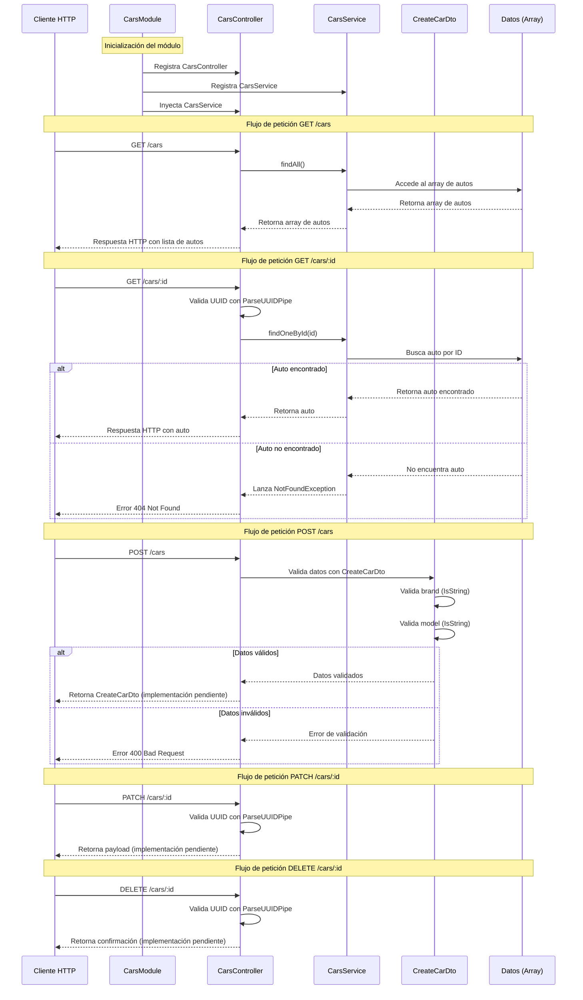

# Diagrama de Secuencia UML - Módulo de Autos

## Descripción
Este diagrama muestra las interacciones entre los componentes del módulo de autos en NestJS: CarsModule, CarsController, CarsService y CreateCarDto.

## Diagrama de Secuencia

## Componentes del Diagrama

### CarsModule
- **Responsabilidad**: Configuración y registro de componentes
- **Funciones**:
  - Registra CarsController como controlador
  - Registra CarsService como proveedor
  - Maneja la inyección de dependencias

### CarsController
- **Responsabilidad**: Manejo de peticiones HTTP
- **Endpoints**:
  - `GET /cars` - Obtener todos los autos
  - `GET /cars/:id` - Obtener auto por ID
  - `POST /cars` - Crear nuevo auto
  - `PATCH /cars/:id` - Actualizar auto
  - `DELETE /cars/:id` - Eliminar auto

### CarsService
- **Responsabilidad**: Lógica de negocio y acceso a datos
- **Métodos**:
  - `findAll()` - Retorna todos los autos
  - `findOneById(id)` - Busca auto por ID y lanza excepción si no existe

### CreateCarDto
- **Responsabilidad**: Validación de datos de entrada
- **Validaciones**:
  - `brand`: Debe ser string
  - `model`: Debe ser string (obligatorio)

## Notas de Implementación

1. **Validación de UUID**: Se usa `ParseUUIDPipe` para validar IDs en las rutas
2. **Manejo de Errores**: El servicio lanza `NotFoundException` cuando no encuentra un auto
3. **Validación de DTOs**: Se usa `class-validator` para validar datos de entrada
4. **Implementaciones Pendientes**: Los métodos POST, PATCH y DELETE están parcialmente implementados

## Flujo de Datos

1. **Cliente** envía petición HTTP al **Controller**
2. **Controller** valida parámetros y datos de entrada
3. **Controller** delega lógica de negocio al **Service**
4. **Service** accede a los datos y aplica reglas de negocio
5. **Service** retorna resultado al **Controller**
6. **Controller** retorna respuesta HTTP al **Cliente**

